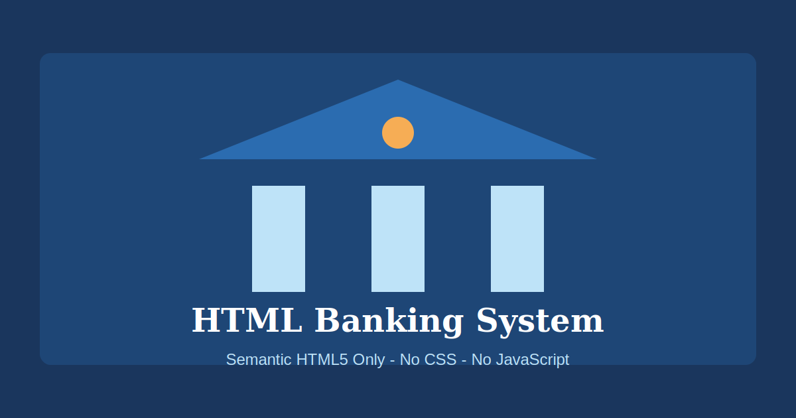

<p align="center">
  
</p>

<h1 align="center">HTML Banking System</h1>

<p align="center">
  <strong>A complete banking interface built with pure semantic HTML5 — no CSS, no JavaScript, no frameworks.</strong>
</p>

<p align="center">
  <a href="https://github.com/MuhammadShahsawar/HTML-Banking-System/actions/workflows/deploy.yml">
    
  </a>
  <a href="https://github.com/MuhammadShahsawar/HTML-Banking-System/blob/main/LICENSE">
    
  </a>
  <a href="https://html-banking-system.roboticela.com">
    
  </a>
  
  
</p>

---

## Description

**HTML Banking System** is a portfolio-grade, open-source banking interface that demonstrates the power of semantic HTML5 markup. Every page — from account dashboards to loan applications — is crafted using only standard HTML elements: no stylesheets, no scripts, no build tools, and no external dependencies.

This project is ideal for developers learning semantic HTML, accessibility best practices, and how far pure markup can go in structuring complex application interfaces.

---

## Features

- **Dashboard** — Account summary, recent transactions, and quick actions
- **Accounts** — Checking, savings, and business account management
- **Transactions** — Filterable transaction history with export options
- **Loans** — Active loan details, payment schedules, and applications
- **Credit Cards** — Card balances, payments, and new card applications
- **Transfers** — Internal and external fund transfers with saved recipients
- **Login** — Secure sign-in and password recovery forms
- **Registration** — Full new customer onboarding form
- **Contact** — Support hours, contact form, FAQ, and branch locations
- **GitHub Pages** — Automatic deployment on every push to `main`
- **100% HTML5** — Zero CSS, zero JavaScript, zero frameworks

---

## Screenshots

<p align="center">
  
</p>

> The interface uses browser-default styling to showcase pure semantic structure. Visit the [live demo](https://html-banking-system.roboticela.com) to explore all pages.

---

## Live Demo

🌐 **Production:** [https://html-banking-system.roboticela.com](https://html-banking-system.roboticela.com)

📦 **GitHub Pages:** [https://muhammadshahsawar.github.io/HTML-Banking-System/](https://muhammadshahsawar.github.io/HTML-Banking-System/)

---

## Installation

No build step required. Clone the repository and open any HTML file in your browser.

```bash
git clone https://github.com/MuhammadShahsawar/HTML-Banking-System.git
cd HTML-Banking-System
```

### Option 1: Open directly

Double-click `index.html` or open it from your browser's File menu.

### Option 2: Local server (optional)

For consistent relative-path behavior during development:

```bash
# Python 3
python -m http.server 8080

# Then visit http://localhost:8080
```

---

## Usage

1. Open `index.html` to access the **Dashboard**
2. Use the navigation menu to visit any section:
   - `pages/accounts.html` — Manage accounts
   - `pages/transactions.html` — View transaction history
   - `pages/loans.html` — Loan management
   - `pages/credit-cards.html` — Credit card services
   - `pages/transfers.html` — Fund transfers
   - `pages/login.html` — Sign in
   - `pages/register.html` — Create an account
   - `pages/contact.html` — Support and contact

All forms use standard HTML `method="get"` and are presentational — no backend is included.

---

## Project Structure

```
HTML-Banking-System/
├── .github/
│   └── workflows/
│       └── deploy.yml          # GitHub Pages CI/CD
├── assets/
│   ├── icon.svg                # Project logo
│   ├── favicon.svg             # Browser favicon
│   └── preview.svg             # Social / README preview
├── pages/
│   ├── accounts.html           # Account management
│   ├── transactions.html       # Transaction history
│   ├── loans.html              # Loan services
│   ├── credit-cards.html       # Credit card management
│   ├── transfers.html          # Fund transfers
│   ├── login.html              # User login
│   ├── register.html           # New user registration
│   └── contact.html            # Contact & support
├── index.html                  # Dashboard (home page)
├── README.md                   # Project documentation
├── LICENSE                     # MIT License
└── .gitignore                  # Git ignore rules
```

---

## HTML Features Demonstrated

| Feature | Usage |
|---------|-------|
| Semantic layout | `<header>`, `<nav>`, `<main>`, `<section>`, `<article>`, `<aside>`, `<footer>` |
| Data tables | `<table>`, `<caption>`, `<thead>`, `<tbody>`, `<tfoot>`, `scope` attributes |
| Forms | `<form>`, `<fieldset>`, `<legend>`, `<label>`, `<input>`, `<select>`, `<textarea>` |
| Definition lists | `<dl>`, `<dt>`, `<dd>` for key-value account details |
| Time elements | `<time datetime="...">` for dates and timestamps |
| Data elements | `<data value="...">` for machine-readable values |
| Abbreviations | `<abbr title="...">` for APY, APR, ACH, ET |
| Expandable content | `<details>` and `<summary>` for FAQ sections |
| Contact info | `<address>` for structured contact details |
| Navigation | `aria-label`, `aria-current`, `aria-labelledby` |
| Favicon | `<link rel="icon">` with SVG favicon |
| Meta tags | `description`, `viewport`, `author`, `keywords` |

---

## Accessibility Features

- **Semantic landmarks** — Screen readers can navigate by region (`header`, `main`, `nav`, `footer`)
- **ARIA labels** — `aria-label` and `aria-labelledby` on navigation and sections
- **Table accessibility** — `scope` attributes on headers; captions describe table purpose
- **Form labels** — Every input is associated with a `<label>` element
- **Fieldset grouping** — Related form controls grouped with `<fieldset>` and `<legend>`
- **Current page indication** — `aria-current="page"` on active navigation links
- **Abbreviation expansion** — `<abbr>` elements provide full terms for acronyms
- **Structured contact** — `<address>` element for contact information
- **Language attribute** — `lang="en"` on every page

---

## Browser Support

| Browser | Supported |
|---------|-----------|
| Google Chrome | ✅ Latest |
| Mozilla Firefox | ✅ Latest |
| Microsoft Edge | ✅ Latest |
| Apple Safari | ✅ Latest |
| Opera | ✅ Latest |

All modern browsers render semantic HTML5 natively. No polyfills or transpilation required.

---

## GitHub Pages Deployment

This repository includes a production-ready GitHub Actions workflow at `.github/workflows/deploy.yml`.

### Setup

1. Push this repository to GitHub
2. Go to **Settings → Pages**
3. Under **Build and deployment**, set **Source** to **GitHub Actions**
4. Push to the `main` branch — deployment runs automatically

The workflow uses official GitHub Actions:

- `actions/checkout@v4`
- `actions/configure-pages@v5`
- `actions/upload-pages-artifact@v3`
- `actions/deploy-pages@v4`

---

## Contributing

Contributions are welcome! To contribute:

1. Fork the repository
2. Create a feature branch (`git checkout -b feature/your-feature`)
3. Make your changes using **HTML5 only** — no CSS or JavaScript
4. Commit with a clear message (`git commit -m 'Add feature description'`)
5. Push to your branch (`git push origin feature/your-feature`)
6. Open a Pull Request

Please ensure all new pages follow existing semantic patterns and include proper accessibility attributes.

---

## License

This project is licensed under the **MIT License** — see the [LICENSE](LICENSE) file for details.

---

## Author

**Muhammad Shawsawar**

- GitHub: [@MuhammadShahsawar](https://github.com/MuhammadShahsawar)
- Email: [muhammad@roboticela.com](mailto:muhammad@roboticela.com)
- Website: [html-banking-system.roboticela.com](https://html-banking-system.roboticela.com)

---

## Acknowledgements

- [W3C HTML5 Specification](https://html.spec.whatwg.org/) — Foundation for semantic markup
- [MDN Web Docs](https://developer.mozilla.org/en-US/docs/Web/HTML) — HTML reference and best practices
- [Web Content Accessibility Guidelines (WCAG)](https://www.w3.org/WAI/standards-guidelines/wcag/) — Accessibility guidance
- [GitHub Pages](https://pages.github.com/) — Free static site hosting
- [GitHub Actions](https://github.com/features/actions) — Continuous deployment

---

## Repository Metadata

| Field | Value |
|-------|-------|
| **Repository Name** | `HTML-Banking-System` |
| **Description** | A semantic HTML5-only banking interface — accounts, transactions, loans, credit cards, transfers, login, registration, and contact. No CSS. No JavaScript. |
| **Version** | `1.0.0` |
| **License** | MIT |
| **Topics** | `html5`, `semantic-html`, `banking`, `accessibility`, `github-pages`, `portfolio`, `static-site`, `web-standards`, `financial-ui`, `no-javascript` |
| **Keywords** | banking system, HTML5, semantic HTML, accessible web, static banking UI, portfolio project, GitHub Pages, financial interface, pure HTML |
| **Tags** | `v1.0.0`, `html5`, `banking`, `semantic-markup`, `open-source` |
